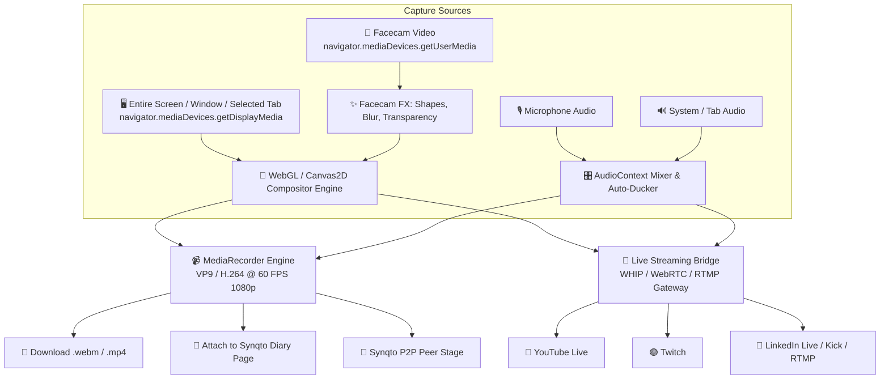
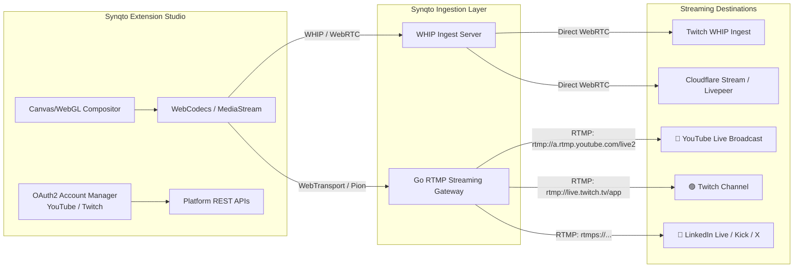
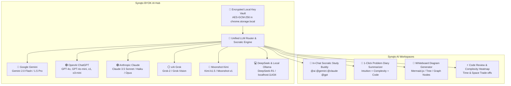

# 🎬 Synqto Video Recording, Live Streaming & Multi-LLM AI Studio — Architectural Plan

> **Document Type**: Architecture & Engineering Specification  
> **Status**: Planned for Next Release Cycle  
> **Target Capabilities**: Screen / Tab / Window Capture, PiP Facecam, YouTube Coding Tutorial Templates, Mouse Proximity Auto-Fade, Chroma & Geometry FX, Audio Ducking, Multi-Platform Live Streaming (YouTube Live, Twitch, LinkedIn, Kick), Bring-Your-Own-LLM AI Model Linking (Google Gemini, OpenAI ChatGPT, Anthropic Claude, xAI Grok, Moonshot Kimi, DeepSeek, Local Ollama), and Local Diary Integration.

---

## 1. Executive Summary & Vision

Modern coding tutorials, code reviews, live coding streams, and competitive programming walkthroughs (popularized by creators on YouTube and Twitch like *NeetCode*, *Fireship*, *Theo - t3.gg*, *ThePrimeagen*, and *Web Dev Simplified*) rely on a distinct, distraction-free visual layout:
1. High-fidelity editor / problem view with crystal-clear code readability.
2. An expressive, non-intrusive presenter facecam positioned in a corner or side column.
3. **Zero code obstruction** — when the cursor moves towards the facecam to edit code underneath, the facecam must either **fade to transparent** or **intelligently dodge** to the opposite side.
4. Professional presentation effects: mouse click ripples, keystroke shortcuts overlay, audio noise suppression, and automatic background audio ducking.
5. **1-Click Multi-Platform Live Streaming**: Broadcast live problem-solving sessions directly to **YouTube Live**, **Twitch**, **LinkedIn Live**, **Twitter/X**, and **Kick** with synchronized multi-chat overlays, without needing heavy external tools like OBS.
6. **Bring-Your-Own-LLM (BYOK / AI Model Linking)**: Link your personal API keys for **Google Gemini**, **OpenAI ChatGPT**, **Anthropic Claude**, **xAI Grok**, **Moonshot Kimi**, **DeepSeek**, or **Local Ollama** to have an in-chat Socratic tutor, auto-generate diary notes, and render whiteboard architecture diagrams.

This plan details how Synqto will integrate an **in-browser video recording, live streaming, and AI study companion studio** directly into the Chrome extension with zero external dependencies.

---

## 2. Capture Sources & Ingestion Pipeline



### 2.1 Video Ingestion Options
| Source Type | API Implementation | Use Case |
| :--- | :--- | :--- |
| **Active Tab Only** | `chrome.tabCapture.getMediaStreamId` / `preferCurrentTab: true` | Record only the LeetCode/Codeforces problem tab without recording other browser tabs or desktop notifications. |
| **Specific Window** | `navigator.mediaDevices.getDisplayMedia({ video: { displaySurface: 'window' } })` | Record VS Code, terminal, or browser window. |
| **Entire Screen** | `navigator.mediaDevices.getDisplayMedia({ video: { displaySurface: 'monitor' } })` | Full desktop capture for multi-window workflows. |
| **Camera Only** | `navigator.mediaDevices.getUserMedia({ video: { width: 1920, height: 1080 } })` | Direct webcam walkthrough or whiteboard explanation. |

### 2.2 Audio Ingestion & Mixing
- **Mic Input**: 48kHz stereo with hardware echo cancellation, noise suppression, and auto gain control.
- **System / Tab Audio**: Audio captured from browser tab/system audio stream.
- **AudioContext Ducking Node**:
  - Dynamically lowers system audio volume by **60-70%** whenever voice mic input crosses `-35dB` threshold.
  - Automatically restores volume when presenter stops speaking with a smooth 300ms release curve.

---

## 3. YouTube Coding Tutorial Layout Templates

The compositor supports 4 preset layouts tailored for developer tutorials:

```
┌──────────────────────────────────────┐  ┌──────────────────────────────┬──────┐
│  TEMPLATE 1: Studio PiP (Corner)     │  │  TEMPLATE 2: Split Stage     │ Cam  │
│                                      │  │                              ├──────┤
│   [ Screen / Code / Whiteboard ]     │  │   [ 75% Code / Problem ]     │ Chat │
│                                      │  │                              │  &   │
│                              ┌─────┐ │  │                              │ Notes│
│                              │ Cam │ │  │                              │      │
│                              └─────┘ │  │                              │      │
└──────────────────────────────────────┘  └──────────────────────────────┴──────┘

┌──────────────────────────────────────┐  ┌──────────────────────────────────────┐
│  TEMPLATE 3: Side-by-Side Dual Tutor │  │  TEMPLATE 4: Whiteboard Lecture      │
│ ┌────────────────┐┌────────────────┐ │  │  ┌─────────────────────────────────┐ │
│ │                ││                │ │  │  │  Full-Width High-DPI Canvas     │ │
│ │  Screen Share  ││ Alice    Bob   │ │  │  │  (Drawings, Tree Nodes, System) │ │
│ │  or Editor     ││ ┌───┐   ┌───┐  │ │  │  └─────────────────────────────────┘ │
│ │                ││ └───┘   └───┘  │ │  │     ┌─────────┐                      │
│ └────────────────┘└────────────────┘ │  │     │ Presenter 16:9 Bubble          │
└──────────────────────────────────────┘  └──────────────────────────────────────┘
```

---

## 4. Smart Pro FX & Developer-First Features

### 4.1 The "Never-Block-Code" Engine (Mouse Proximity Auto-Fade & Smart Dodge)
- **Mode A: Proximity Fade (Alpha Transparency)**:
  $$\text{Distance } d = \sqrt{(x_{\text{mouse}} - x_{\text{cam}})^2 + (y_{\text{mouse}} - y_{\text{cam}})^2}$$
  - If $d > 180\text{px}$: Camera opacity is $100\%$.
  - If $50\text{px} \le d \le 180\text{px}$: Camera opacity linearly scales down to $15\%$.
  - If $d < 50\text{px}$: Camera opacity drops to $5\%$ with a dotted outline so code behind is 100% readable.
- **Mode B: Corner Smart-Dodge**:
  - When mouse remains within the camera box for $> 400\text{ms}$ while typing, the facecam smoothly glides to the opposite corner.

### 4.2 Facecam Geometry, Shapes & Borders
- **Circle Avatar**: Classic clean circular facecam ($120\text{px} - 280\text{px}$ diameter).
- **Squircle (iOS Rounded Rect)**: Modern smooth corners ($r = 24\text{px}$).
- **Hexagon / Tech Badge**: Ideal for tech reviews and livestreams.
- **Aspect Ratio Toggles**: 1:1 Square, 4:3 Classic, 16:9 Widescreen.

### 4.3 Virtual Background & Chroma Key
- **Real-Time Background Blur**: Uses `@mediapipe/selfie_segmentation` to separate subject from background, blurring room background without requiring a physical green screen.
- **Chroma Key**: 1-click green/blue color picker with tolerance and smoothness sliders.

### 4.4 Mouse Click FX & Keystroke HUD
- **Mouse Highlight Halo**: Subtle colored halo ring following the mouse pointer.
- **Click Ripple**: Concentric expanding ring animation on mouse clicks.
- **Keystroke HUD Overlay**: Displays keyboard shortcuts pressed by the presenter (e.g. `Ctrl + Shift + P`, `Cmd + B`) in a floating glass pill.

---

## 5. Technical Implementation Architecture

### 5.1 High-Performance WebGL/Canvas2D Compositor Loop
To ensure 60 FPS recording with zero frame drops during heavy coding/compiling:

```typescript
export class VideoCompositor {
  private canvas: OffscreenCanvas;
  private ctx: OffscreenCanvasRenderingContext2D;
  private screenVideo: HTMLVideoElement;
  private cameraVideo: HTMLVideoElement;
  private options: VideoRecordingOptions;

  public startRenderLoop() {
    const render = () => {
      // 1. Draw base screen capture
      this.ctx.drawImage(this.screenVideo, 0, 0, this.width, this.height);

      // 2. Compute mouse distance for auto-fade
      const alpha = this.calculateFacecamAlpha(this.mousePos, this.cameraRect);

      // 3. Clip camera to desired shape (Circle / Squircle / Hexagon)
      this.ctx.save();
      this.ctx.globalAlpha = alpha;
      this.applyShapeClip(this.ctx, this.cameraRect, this.options.cameraShape);
      this.ctx.drawImage(this.cameraVideo, this.cameraRect.x, this.cameraRect.y, this.cameraRect.w, this.cameraRect.h);
      this.ctx.restore();

      // 4. Draw mouse halo and click ripples
      this.drawMouseEffects(this.ctx);

      // 5. Draw Keystroke HUD
      if (this.currentKeystroke) {
        this.drawKeystrokePill(this.ctx, this.currentKeystroke);
      }

      requestAnimationFrame(render);
    };
    requestAnimationFrame(render);
  }
}
```

---

## 6. Multi-Platform Live Streaming & App Linking Architecture

Live streaming from a browser extension directly to platforms like **YouTube Live**, **Twitch**, **LinkedIn Live**, and **Kick** requires handling platform authentication (OAuth2), stream key management, and protocol bridges (WebRTC WHIP / RTMP).



### 6.1 App Linking & Account Connection (OAuth2)
| Platform | Authentication / App Link Scope | Capabilities Enabled |
| :--- | :--- | :--- |
| **YouTube Live** | Google OAuth2 (`youtube.force-ssl`) | Auto-creates scheduled or instant live broadcasts, fetches RTMP stream keys, streams live chat into Synqto, and displays live viewer counts. |
| **Twitch** | Twitch OAuth2 (`channel:manage:broadcast`, `chat:read`) | Automatically sets stream category (*Software & Game Development*), updates stream title, fetches ingest endpoints, and embeds Twitch IRC chat. |
| **LinkedIn Live** | LinkedIn Live API / RTMP Stream Key | Broadcasts tech tutorials and resume review workshops to professional networks. |
| **Custom RTMP / WHIP** | Direct `rtmp://` / `https://` Ingest URL + Key | Stream to Kick, Twitter/X, Facebook Live, Restream.io, or private RTMP servers. |

---

## 7. Bring-Your-Own-LLM (BYOK) & Multi-AI Model Linking Architecture

Synqto allows users to link their personal API keys or local models for instant, privacy-first AI pairing during problem solving.



### 7.1 Supported AI Providers & Models
| Provider | Supported Models | Ingestion Method | Typical Strengths |
| :--- | :--- | :--- | :--- |
| **Google Gemini** | `gemini-2.0-flash`, `gemini-1.5-pro`, `gemini-1.5-flash` | Google AI Studio API Key | Ultra-long context window, instant code analysis, multimodal diagram vision. |
| **OpenAI ChatGPT** | `gpt-4o`, `gpt-4o-mini`, `o1`, `o3-mini` | OpenAI API Key | Deep algorithmic reasoning, competitive programming logic, fast code review. |
| **Anthropic Claude** | `claude-3-5-sonnet`, `claude-3-5-haiku`, `claude-3-opus` | Anthropic API Key | Exceptional code elegance, clean refactoring, nuanced Socratic pedagogy. |
| **xAI Grok** | `grok-2`, `grok-2-vision` | xAI API Key | Real-time world knowledge, direct debugging, unfiltered tech analysis. |
| **Moonshot Kimi** | `kimi-k1.5`, `moonshot-v1-8k/32k/128k` | Moonshot API Key | Long problem context retention, high-speed Chinese & English problem translation. |
| **DeepSeek** | `deepseek-chat`, `deepseek-reasoner (R1)` | DeepSeek API Key | State-of-the-art math and algorithmic chain-of-thought at ultra-low cost. |
| **Local Ollama / vLLM** | `llama3.3`, `deepseek-r1:8b`, `qwen2.5-coder` | `http://localhost:11434/v1` endpoint | **100% Offline & Free** — zero telemetry, runs on local GPU/CPU. |

### 7.2 Core AI Capabilities in Synqto

#### A. In-Chat Socratic AI Tutor (`@ai`, `@gemini`, `@claude`, `@gpt`)
- In any room chat, squad discussion, or private diary, type `@ai`, `@gemini`, or `@claude` to summon the AI assistant.
- **Socratic Hint Ladder (Anti-Spoiler Engine)**:
  - **Level 1 (Clarification)**: Asks questions about edge cases (e.g. empty inputs, duplicates, integer overflows).
  - **Level 2 (Intuition)**: Explains the high-level concept (e.g. *"Think of this as finding shortest path in an unweighted grid"*).
  - **Level 3 (Pattern & Invariant)**: Recommends the optimal data structure (e.g. *"Use a Min-Heap of size K"*).
  - **Level 4 (Full Walkthrough)**: Complete code with line-by-line dry run and Big-O derivation (only upon explicit request).

#### B. 1-Click Problem Diary Summarizer
- In the **Synqto Diary & Journal**, tap **"✨ Summarize with AI"**:
  - Extracts the active LeetCode/Codeforces problem title, tags, and description.
  - Automatically writes a clean markdown entry containing:
    1. **Key Insight & Intuition**
    2. **Algorithm Steps & Pitfalls**
    3. **Optimal Code Solution**
    4. **Time & Space Complexity Proof**

#### C. Whiteboard Architecture & Data Structure Generator
- Instruct the AI in natural language:
  - *"Draw a Red-Black Tree insertion of [10, 20, 30]"*
  - *"Generate a microservice architecture with Load Balancer, Redis Cache, and DB Cluster"*
- The AI responds with structured JSON vectors that Synqto instantly paints directly onto the **collaborative canvas**.

#### D. Privacy, Security & Local Encryption
- **Zero Proxy Architecture**: Synqto never routes your API requests through any middleman server. The extension uses direct browser `fetch()` streaming to the respective provider's API.
- **AES-GCM-256 Vault**: API keys are encrypted with a device-unique salt and stored exclusively in `chrome.storage.local`.
- **Usage & Cost Tracking**: Live token counter displaying estimated API cost per session.

---

## 8. Integration with Synqto Diary & Journal

When recording finishes:
1. **Instant Preview Modal**: Playback with seekbar, duration, file size, and trim controls.
2. **1-Click Download**: Saves file as `leetcode-two-sum-walkthrough-2026-08-15.mp4`.
3. **Diary Attachment**: Automatically creates or updates the problem's **Diary Page** with:
   - Video duration & thumbnail preview.
   - Markdown summary with timestamped notes (e.g. `01:24 - Hash map approach`, `03:45 - Complexity analysis`).
   - Attached whiteboard architecture drawings.

---

## 9. Engineering Roadmap & Milestones

| Milestone | Deliverables | Target Timeline |
| :--- | :--- | :--- |
| **Phase 1: Ingestion & Core Mixer** | Screen capture, tab capture, webcam stream, Web Audio mixer with audio ducking. | Sprint 1 |
| **Phase 2: Layout Compositor & Shapes** | WebGL/2D Compositor, 4 layout presets, Circle/Squircle shapes, draggable positioning. | Sprint 2 |
| **Phase 3: Smart FX & Auto-Fade** | Mouse proximity fade, smart corner dodge, mouse click ripples, keystroke HUD. | Sprint 3 |
| **Phase 4: Multi-Platform Live Streaming** | YouTube & Twitch OAuth app linking, WHIP / Go RTMP gateway, unified live chat. | Sprint 4 |
| **Phase 5: Bring-Your-Own-LLM Hub** | Encrypted key vault, Gemini/OpenAI/Claude/Grok/Kimi/Ollama adapters, in-chat Socratic tutor. | Sprint 5 |
| **Phase 6: Diary Integration & Export** | Fast MP4 remuxing, IndexedDB crash recovery, 1-click export to Synqto Diary note. | Sprint 6 |

---

## 10. Summary
This studio engine transforms Synqto into a self-contained, professional broadcast, AI pairing, and tutorial creation platform for students, tutors, competitive programmers, and content creators.
