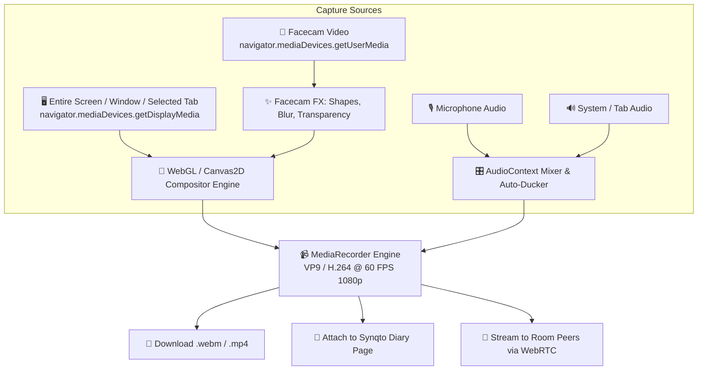

# 🎬 Synqto Video Recording & Coding Tutorial Studio — Architectural Plan

> **Document Type**: Architecture & Engineering Specification  
> **Status**: Planned for Next Release Cycle  
> **Target Capabilities**: Screen / Tab / Window Capture, PiP Facecam, YouTube Coding Tutorial Templates, Mouse Proximity Auto-Fade, Chroma & Geometry FX, Audio Ducking, and Local Diary Integration.

---

## 1. Executive Summary & Vision

Modern coding tutorials, code reviews, and competitive programming walkthroughs (popularized by creators on YouTube like *NeetCode*, *Fireship*, *Theo - t3.gg*, *ThePrimeagen*, and *Web Dev Simplified*) rely on a distinct, distraction-free visual layout:
1. High-fidelity editor / problem view with crystal-clear code readability.
2. An expressive, non-intrusive presenter facecam positioned in a corner or side column.
3. **Zero code obstruction** — when the cursor moves towards the facecam to edit code underneath, the facecam must either **fade to transparent** or **intelligently dodge** to the opposite side.
4. Professional presentation effects: mouse click ripples, keystroke shortcuts overlay, audio noise suppression, and automatic background audio ducking.

This plan details how Synqto will integrate an **in-browser video recording studio** directly into the Chrome extension with zero external dependencies (no OBS or third-party software required).

---

## 2. Capture Sources & Ingestion Pipeline



### 2.1 Video Ingestion Options
| Source Type | API Implementation | Use Case |
| :--- | :--- | :--- |
| **Active Tab Only** | `chrome.tabCapture.getMediaStreamId` / `preferCurrentTab: true` | Record only the LeetCode/Codeforces problem tab without recording other browser tabs or desktop notifications. |
| **Specific Window** | `navigator.mediaDevices.getDisplayMedia({ video: { displaySurface: 'window' } })` | Record VS Code, terminal, or browser window. |
| **Entire Screen** | `navigator.mediaDevices.getDisplayMedia({ video: { displaySurface: 'monitor' } })` | Full desktop capture for multi-window workflows. |
| **Camera Only** | `navigator.mediaDevices.getUserMedia({ video: { width: 1920, height: 1080 } })` | Direct webcam walkthrough or whiteboard explanation. |

### 2.2 Audio Ingestion & Mixing
- **Mic Input**: 48kHz stereo with hardware echo cancellation, noise suppression, and auto gain control.
- **System / Tab Audio**: Audio captured from browser tab/system audio stream.
- **AudioContext Ducking Node**:
  - Dynamically lowers system audio volume by **60-70%** whenever voice mic input crosses `-35dB` threshold.
  - Automatically restores volume when presenter stops speaking with a smooth 300ms release curve.

---

## 3. YouTube Coding Tutorial Layout Templates

The compositor supports 4 preset layouts tailored for developer tutorials:

```
┌──────────────────────────────────────┐  ┌──────────────────────────────┬──────┐
│  TEMPLATE 1: Studio PiP (Corner)     │  │  TEMPLATE 2: Split Stage     │ Cam  │
│                                      │  │                              ├──────┤
│   [ Screen / Code / Whiteboard ]     │  │   [ 75% Code / Problem ]     │ Chat │
│                                      │  │                              │  &   │
│                              ┌─────┐ │  │                              │ Notes│
│                              │ Cam │ │  │                              │      │
│                              └─────┘ │  │                              │      │
└──────────────────────────────────────┘  └──────────────────────────────┴──────┘

┌──────────────────────────────────────┐  ┌──────────────────────────────────────┐
│  TEMPLATE 3: Side-by-Side Dual Tutor │  │  TEMPLATE 4: Whiteboard Lecture      │
│ ┌────────────────┐┌────────────────┐ │  │  ┌─────────────────────────────────┐ │
│ │                ││                │ │  │  │  Full-Width High-DPI Canvas     │ │
│ │  Screen Share  ││ Alice    Bob   │ │  │  │  (Drawings, Tree Nodes, System) │ │
│ │  or Editor     ││ ┌───┐   ┌───┐  │ │  │  └─────────────────────────────────┘ │
│ │                ││ └───┘   └───┘  │ │  │     ┌─────────┐                      │
│ └────────────────┘└────────────────┘ │  │     │ Presenter 16:9 Bubble          │
└──────────────────────────────────────┘  └──────────────────────────────────────┘
```

### Detailed Template Breakdown
1. **Template 1 — Studio PiP (NeetCode / Fireship Mode)**:
   - Fullscreen 1080p display of problem & code.
   - Draggable camera bubble in any corner (Bottom-Right, Bottom-Left, Top-Right, Top-Left).
   - Features **Smart Auto-Fade** when typing code underneath the bubble.
2. **Template 2 — Split Stage (ThePrimeagen / Theo Mode)**:
   - 75% width dedicated to code editor or terminal.
   - 25% right column with Facecam at top and live Synqto notes/diary/chat stream below.
3. **Template 3 — Dual-Tutor Pair Programming**:
   - Screen share on left half; dual circular avatar bubbles on right half for peer-to-peer tutoring sessions.
   - Active speaker detection highlights the speaking tutor's camera border with an animated glow.
4. **Template 4 — Architecture Whiteboard Lecture**:
   - 100% vector whiteboard drawing canvas.
   - Floating wide 16:9 presenter video bar at the bottom with adjustable backdrop blur.

---

## 4. Smart Pro FX & Developer-First Features

### 4.1 The "Never-Block-Code" Engine (Mouse Proximity Auto-Fade & Smart Dodge)
One of the most annoying flaws in tutorial videos is when the presenter's webcam blocks code, terminal output, or compiler errors at the bottom of the screen.

**Solution: Dual-Mode Obstruction Prevention**:
- **Mode A: Proximity Fade (Alpha Transparency)**:
  $$\text{Distance } d = \sqrt{(x_{\text{mouse}} - x_{\text{cam}})^2 + (y_{\text{mouse}} - y_{\text{cam}})^2}$$
  - If $d > 180\text{px}$: Camera opacity is $100\%$.
  - If $50\text{px} \le d \le 180\text{px}$: Camera opacity linearly scales down to $15\%$.
  - If $d < 50\text{px}$: Camera opacity drops to $5\%$ with a dotted outline so code behind is 100% readable.
- **Mode B: Corner Smart-Dodge**:
  - When mouse remains within the camera box for $> 400\text{ms}$ while typing, the facecam smoothly glides (CSS `cubic-bezier(0.16, 1, 0.3, 1)`) to the opposite corner.

### 4.2 Facecam Geometry, Shapes & Borders
- **Circle Avatar**: Classic clean circular facecam ($120\text{px} - 280\text{px}$ diameter).
- **Squircle (iOS Rounded Rect)**: Modern smooth corners ($r = 24\text{px}$).
- **Hexagon / Tech Badge**: Ideal for tech reviews and livestreams.
- **Aspect Ratio Toggles**: 1:1 Square, 4:3 Classic, 16:9 Widescreen.
- **Border Customization**:
  - Gradient borders (e.g. Indigo to Violet, Emerald to Cyan).
  - Speaking indicator: Audio-reactive pulsating border ring when mic is active.

### 4.3 Virtual Background & Chroma Key
- **Real-Time Background Blur**: Uses `@mediapipe/selfie_segmentation` to separate subject from background, blurring room background without requiring a physical green screen.
- **Chroma Key**: 1-click green/blue color picker with tolerance and smoothness sliders.
- **Opacity Slider**: Adjust facecam overlay opacity from $10\%$ to $100\%$.

### 4.4 Mouse Click FX & Keystroke HUD
- **Mouse Highlight Halo**: Subtle colored halo ring following the mouse pointer.
- **Click Ripple**: Concentric expanding ring animation on mouse clicks (Left click = Blue, Right click = Amber).
- **Keystroke HUD Overlay**:
  - Displays keyboard shortcuts pressed by the presenter (e.g. `Ctrl + Shift + P`, `Cmd + B`, `Alt + Enter`) in a floating glass pill in the bottom center.

---

## 5. Technical Implementation Architecture

### 5.1 High-Performance WebGL/Canvas2D Compositor Loop
To ensure 60 FPS recording with zero frame drops during heavy coding/compiling:

```typescript
export class VideoCompositor {
  private canvas: OffscreenCanvas;
  private ctx: OffscreenCanvasRenderingContext2D;
  private screenVideo: HTMLVideoElement;
  private cameraVideo: HTMLVideoElement;
  private options: VideoRecordingOptions;

  public startRenderLoop() {
    const render = () => {
      // 1. Draw base screen capture
      this.ctx.drawImage(this.screenVideo, 0, 0, this.width, this.height);

      // 2. Compute mouse distance for auto-fade
      const alpha = this.calculateFacecamAlpha(this.mousePos, this.cameraRect);

      // 3. Clip camera to desired shape (Circle / Squircle / Hexagon)
      this.ctx.save();
      this.ctx.globalAlpha = alpha;
      this.applyShapeClip(this.ctx, this.cameraRect, this.options.cameraShape);
      this.ctx.drawImage(this.cameraVideo, this.cameraRect.x, this.cameraRect.y, this.cameraRect.w, this.cameraRect.h);
      this.ctx.restore();

      // 4. Draw mouse halo and click ripples
      this.drawMouseEffects(this.ctx);

      // 5. Draw Keystroke HUD
      if (this.currentKeystroke) {
        this.drawKeystrokePill(this.ctx, this.currentKeystroke);
      }

      requestAnimationFrame(render);
    };
    requestAnimationFrame(render);
  }
}
```

### 5.2 MediaRecorder & Encoding Options
- **Container**: WebM (`video/webm;codecs=vp9,opus`) with MP4 export fallback (`video/mp4;codecs=avc1.4d002a,mp4a.40.2`).
- **Bitrate**: Dynamic bitrate allocation ($4.5\text{ Mbps} - 8.0\text{ Mbps}$ for crisp $1080\text{p}60$).
- **Timeslice Chunking**: Saves recording chunks every $1000\text{ms}$ into IndexedDB so video is never lost even if the tab accidentally crashes.

---

## 6. Integration with Synqto Diary & Journal

When recording finishes:
1. **Instant Preview Modal**: Playback with seekbar, duration, file size, and trim controls.
2. **1-Click Download**: Saves file as `leetcode-two-sum-walkthrough-2026-08-15.mp4`.
3. **Diary Attachment**: Automatically creates or updates the problem's **Diary Page** with:
   - Video duration & thumbnail preview.
   - Markdown summary with timestamped notes (e.g. `01:24 - Hash map approach`, `03:45 - Complexity analysis`).
   - Attached whiteboard architecture drawings.

---

## 7. Engineering Roadmap & Milestones

| Milestone | Deliverables | Target Timeline |
| :--- | :--- | :--- |
| **Phase 1: Ingestion & Core Mixer** | Screen capture, tab capture, webcam stream, Web Audio mixer with audio ducking. | Sprint 1 |
| **Phase 2: Layout Compositor & Shapes** | WebGL/2D Compositor, 4 layout presets, Circle/Squircle shapes, draggable positioning. | Sprint 2 |
| **Phase 3: Smart FX & Auto-Fade** | Mouse proximity fade, smart corner dodge, mouse click ripples, keystroke HUD. | Sprint 3 |
| **Phase 4: Diary Integration & Export** | Fast MP4 remuxing, IndexedDB crash recovery, 1-click export to Synqto Diary note. | Sprint 4 |

---

## 8. Summary
This recording engine transforms Synqto into a self-contained, studio-grade video walkthrough creator for students, tutors, content creators, and engineering interviewers.
